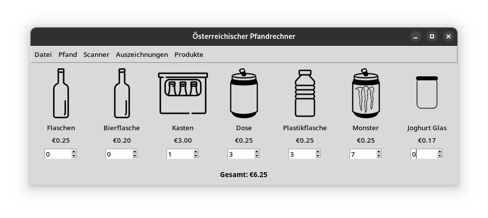

# Pfandrechner Application

%% Version 7.02.207 %%

A comprehensive application suite designed to manage and calculate deposits ("Pfand") for various containers within the Austrian deposit refund system. The suite offers a modern graphical user interface (GUI) and includes utilities for building and managing the application.

## Project Overview

The Pfandrechner Application Suite provides tools to:

- **Calculate Deposits:** Accurately compute deposit values for different container types.
- **Track Achievements:** Unlock rewards based on deposit activities.
- **Maintain History:** Record deposit transactions and export them for analysis.
- **Manage Data:** Ensure data persistence and efficient management.
- **Support Images:** Integrate images for containers and achievements to enhance user experience.
- **TooGoodToGo Integration:** A simple window to check active orders from TooGoodToGo.
- **API Key Management:** A window to set and save API details to a `key.py` file.

## Features

- **Real-time Deposit Calculations:** Instantly compute deposit values as containers are added.
- **Achievement System:** Unlock various tiers of rewards based on deposit milestones.
- **History Tracking:** Maintain a log of all deposit transactions with options to export in CSV format.
- **Automatic Data Saving:** Ensure all data is saved without manual intervention.
- **Image Management:** Associate images with containers and achievements for better visualization.
- **Keyboard Shortcuts:** Utilize shortcuts for common actions to enhance usability.

## Functionality of `main.py`

The `main.py` file serves as the core of the Pfandrechner Application Suite, orchestrating various functionalities to provide a comprehensive user experience. Key functionalities include:

- **Graphical User Interface (GUI) Initialization:** Sets up and launches the main application window, providing users with an intuitive interface to interact with the application's features.
- **Deposit Calculation:** Enables users to input various container types and quantities, automatically computing the total deposit value based on predefined rates.
- **Achievement Tracking:** Monitors user activities related to deposit returns and unlocks achievements when specific milestones are reached, enhancing user engagement.
- **History Management:** Maintains a detailed log of all deposit transactions, allowing users to review past activities and export records for external analysis.
- **Data Persistence:** Ensures that all user data, including transaction history and achievements, are saved and reloaded upon subsequent application launches, preventing data loss.
- **Image Integration:** Displays relevant images for different container types and achievements within the GUI, providing a visually enriched user experience.
- **Keyboard Shortcuts:** Implements various keyboard shortcuts to facilitate quick access to common functions, improving overall usability and efficiency.

## Project Structure

The repository is organized as follows:

- `main.py`: The main application script that launches the Pfandrechner GUI.
- `pfand_scanner.py`: Module responsible for scanning and identifying container types.
- `buildutil/`: Directory containing utilities for building and packaging the application.
- `images/`: Folder storing images associated with containers and achievements.
- `tgtg_orderchecker/`: Module for checking orders, related to the "Too Good To Go" initiative.
- `wiki/`: Documentation and resources related to the project.
- `.gitignore`: Specifies files and directories to be ignored by Git.
- `LICENSE`: The MIT license governing the use of this project.
- `README.md`: This document providing an overview of the project.
- `requirements.txt`: Lists the Python dependencies required to run the application.
- `launch.cpp`: A C++ script, that monitors usage of RAM & CPU (mainly to debug)
- `key.py`: A file where API details for the TooGoodToGo integration are stored.

## Installation

To set up the Pfandrechner Application Suite:

1. **Clone the Repository:**

   ```bash
   git clone https://github.com/ZockerKatze/pfand.git
   ```

2. **Navigate to the Project Directory:**

   ```bash
   cd pfand
   ```

3. **Create and Activate a Virtual Environment (Recommended):**

   On Windows:
   ```bash
   python -m venv venv
   venv\Scripts\activate
   ```
   On macOS/Linux:
   ```bash
   python3 -m venv venv
   source venv/bin/activate
   ```

4. **Install Dependencies:**

   Ensure you have Python installed. Then, install the required Python packages:

   ```bash
   pip install -r requirements.txt
   ```

5. **Run the Application:**

   Launch the main application:

   ```bash
   python main.py
   ```

## Usage

Upon running `main.py`, the GUI will be displayed, allowing users to:

- Add containers and calculate their deposit values.
- View and unlock achievements based on deposit milestones.
- Track deposit history and export records as needed.
- Check active orders from TooGoodToGo.
- Set API keys via the dedicated settings window. (TGTG)

## Application Screenshot



## Contributing

Contributions to the Pfandrechner Application Suite are welcome. To contribute:

1. Fork the repository.
2. Create a new branch for your feature or bugfix.
3. Commit your changes with descriptive messages.
4. Push your branch and create a pull request.

Please ensure adherence to the project's coding standards and include relevant documentation with your contributions.

## License

This project is licensed under the MIT License. For more details, refer to the `LICENSE` file in the repository.

---

*Note: This README is based on the current structure and available information from the repository. For the latest updates and detailed documentation, please refer to the project's wiki or contact the repository maintainers.*

